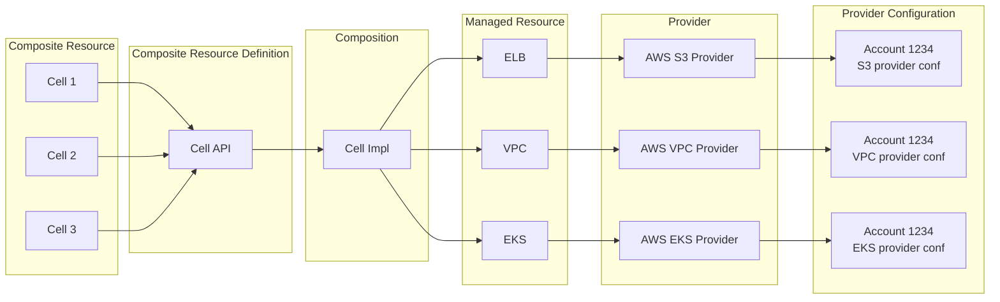
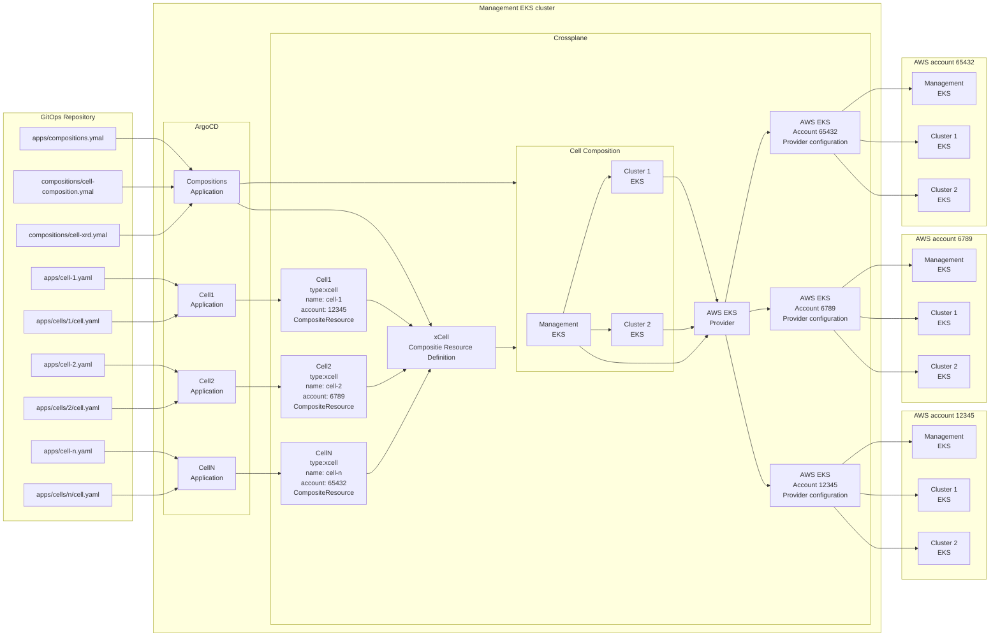

# Crossplane demo

## Setup

1. Create crossplane provider secrets in mgmt/secrets ([docs](https://docs.crossplane.io/v1.18/getting-started/provider-aws/#generate-an-aws-key-pair-file))

    ```yaml
    apiVersion: v1
    kind: Secret
    metadata:
      name: s3-779291601624
      namespace: crossplane-system
    data:
      creds:  ...
    ```

1. Create management cluster by running `./mgmt-cluster/create.sh`

Kind cluster will be created and bootstrapped with argocd.

- Crossplane and all resources will be created by argo
- The argo admin password will be copied to your clipboard
- Port forward for argo will be created on port 8080
- ArgoCD login page will open and you can login as admin with password from clipboard


## Destroy

> AWS resources are not going to be removed.

Run `./mgmt-cluster/create.sh` to destroy kind cluster. 

## Repository structure

> TODO

## Crossplane resources

- Compositions - A template to define how to create resources.
- Composite Resource Definition (XRD) - A custom API specification.
- Composite Resource (XR) - Created by using the custom API defined in a Composite Resource Definition. XRs use the Composition template to create new managed resources.
- Claims (XRC) - Like a Composite Resource, but with namespace scoping.



## Architecture


