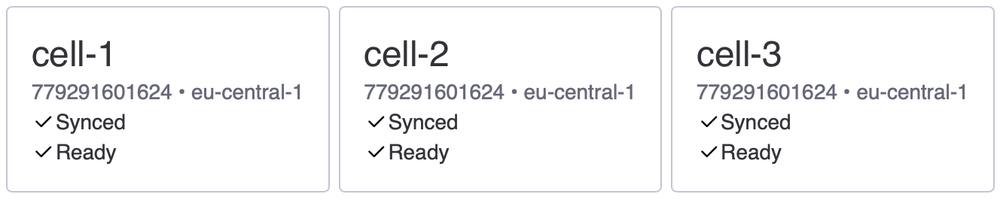
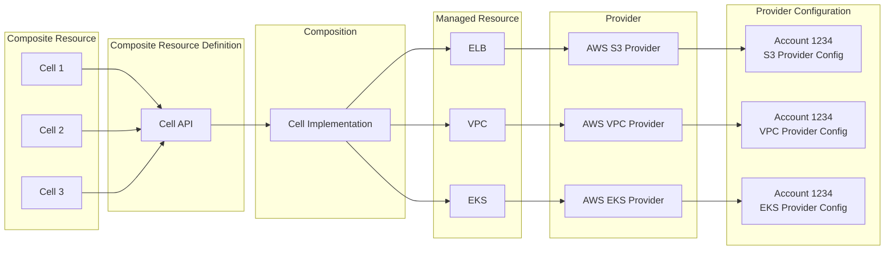
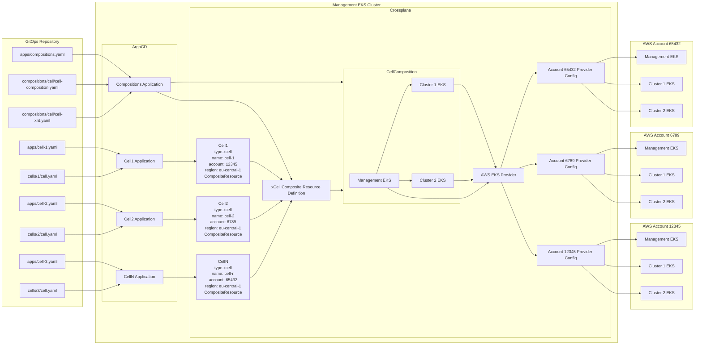

# Crossplane demo

## Setup

1. Create crossplane provider secrets in mgmt-cluster/secrets. Secret name must be composed of `cellName-providerType-accountId`. ([docs](https://docs.crossplane.io/v1.18/getting-started/provider-aws/#generate-an-aws-key-pair-file))

    ```yaml
    apiVersion: v1
    kind: Secret
    metadata:
      name: cell-1-s3-779291601624
      namespace: crossplane-system
    data:
      creds:  ...
    ```

1. Create management cluster by running `./mgmt-cluster/create.sh`

Kind cluster will be created and bootstrapped with argocd.

- Crossplane and all resources will be created by argo
- The argo admin password will be copied to your clipboard
- Port forward for argo will be created on port 8080
- ArgoCD login page will open and you can login as admin with password from clipboard


## Destroy

> AWS resources are not going to be removed.

Run `./mgmt-cluster/create.sh` to destroy kind cluster.

## Repository structure

- docs - documentation assets
- frontend - sample frontend application presenting data from kubernetes-api-client
- gitops - kubernetes manifests
- kubernetes-api-client - Demo of querying Crossplane Composite Resources from kubernetes API using nodejs.
- mgmt-cluster - local kind cluster with crossplane and argocd



## Crossplane resources

- Compositions - A template to define how to create resources.
- Composite Resource Definition (XRD) - A custom API specification.
- Composite Resource (XR) - Created by using the custom API defined in a Composite Resource Definition. XRs use the Composition template to create new managed resources.
- Claims (XRC) - Like a Composite Resource, but with namespace scoping.



## Architecture



## Q&A

> TODO

1. __Q:__ How to disable reconciliation

   __A:__ ...

1. __Q:__ How to manage resources in multiple AWS accounts

   __A:__ ...

1. __Q:__ How to query managed resources

   __A:__ Use kubernetes API client library to fetch managed resources. Check example code in `kubernetes-api-client`

1. __Q:__ How to manage cell's management cluster

   __A:__ Crossplane can create EKS clusters and deploy applications using helm provider ([docs](https://docs.crossplane.io/v1.18/guides/multi-tenant/#control-plane-of-control-planes))

1. __Q:__ How to progressively update XRs (manual Composition updates)

   __A:__ TODO

## References

- [Crossplane documentation](https://docs.crossplane.io/v1.18/)
- [Reference platfrom implementation for AWS](https://github.com/upbound/platform-ref-aws) - example how to build platform API
- [Community extensions](https://github.com/orgs/crossplane-contrib/repositories?type=all) - additional functions, providers
- [Upbound marketplace](https://marketplace.upbound.io) - providers,configurations, functions
- [AWS Network Configuration](https://marketplace.upbound.io/configurations/upbound/configuration-aws-network/v0.22.0/compositions/xnetworks.aws.platform.upbound.io/aws.platform.upbound.io/XNetwork)
- [AWS EKS configuration](https://marketplace.upbound.io/configurations/upbound/configuration-aws-eks/v0.15.0)

## TODO

- [ ] [configure argo cd](https://docs.crossplane.io/v1.18/guides/crossplane-with-argo-cd/)
- [ ] Fix provider config being not ready
- [ ] Add custom composition function
  - [ ] try cdk8s to generate resources
- [ ] pass data between pipeline steps
  - [ ] using xrd status properties
  - [ ] using environment
- [ ] Use single provider per account instead of splitting per managed resource type
- [ ] Create custom provider for KindCluster, to enable Compositions POCs in local env
